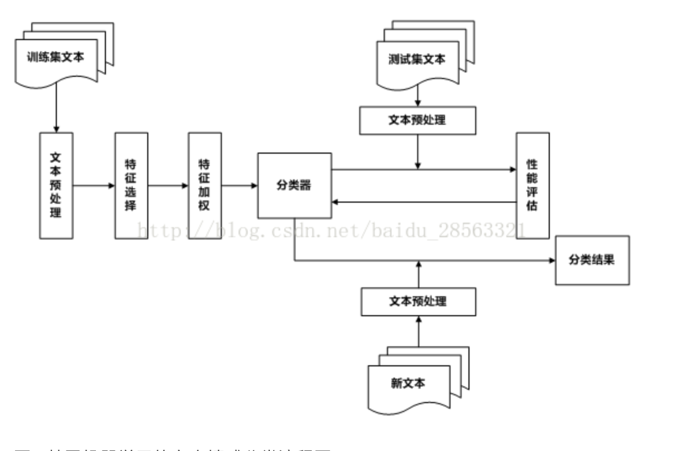

# 文本感情分析
常用方法
##### 1.基于词典的感情分析
需要学习hanlp算法
基于词典的情感分析大致步骤如下： 对大于句子力度的文本进行拆解句子操作，以句子为最小分析单元； 分析句子中出现的词语并按照情感词典匹配； 处理否定逻辑及转折逻辑；计算整句情感词得分（根据词语不同，极性不同，程度不同等因素进行加权求和）；根据情感得分输出句子情感倾向性。
##### 2.机器学习
基于机器学习的情感分析思路是将情感分析作为一个分类问题来处理
获取特征的传统方法有：Bag of Words (with or without its TFIDF), Bag of ngrams(with or without its TFIDF), Bag of means on word embedding (e.g. using word2vec embedding)
核心： new representation of the original text，即用一列features表示data point
传统的机器学习算法有：Logistic Regression，SVM，Naive Bayes，Neural Net，MaxEnt等
深度学习方法：CNN，RNN，LSTM都已经证明了很好的效果。
深度学习方法可以分为word-level和character-level基于字母的CNN方法，已经证明有很好的效果。
基于机器学习的情感分类问题，它的处理过程大致可以分为两个部分，一部分是学习过程，另一部分是情感分类过程。其中，学习过程包括训练过程和测试过程，训练过程中对训练集进行训练得到分类器，用其对测试集进行情感分类，将测试的结果反馈给分类器，进一步改进训练方法，生成新的分类器，最后利用最终生成的分类器对新的文本进行情感分类，其基本流程如图1所示。

##### 3.常见数据集
常见数据集均是对文本的感情积极消极程度的判断，无法满足软件的需求

# 现有词典的情况
中文领域，判断积极和消极已经有不少词典资源，如Hownet，NTUSD但用过这些词典就知道，效果实在是不咋滴（最近还发现了大连理工发布的情感词汇本体库，不过没用过，不好评价）。中文这方面的开源真心不够英文的做得细致有效。而中文识别主客观，那真的是不能直视。
中文领域难度在于：词典资源质量不高，不细致。另外缺乏主客观词典。
缺少对于文本感情（喜怒哀惧）的词典

# 特征加权
特征选择过程中选择了最能代表文本内容的特征向量，但是这些特征对文本分类的影响不尽相同，因此，有必要对经过选择的特征进行加权，对表征能力强的特征赋予较大权重，对具有较弱类别区分能力的特征赋予较小的权重，这样可以有效抑制噪声。特征加权(Feature Weighting)就是对特征集合中每个特征根据其对分类的贡献程度赋予一定权值的过程。常用的特征加权方法有布尔权重，词频权重，TFIDF权重。本文分别使用了这三种权重计算方法，并对三种方法得到的分类结果进行了对比分析。

设文本类别集合D=d1,d2,…,dn，dk∈D(k=1,2,…,n)，n为文本总数；类别集合C=c1,c2,…,cm，ci∈C(i=1，2，．．．，m)，特征集合T=t1,t2,…,tn，tj∈T(j=1，2，．．．，n)，m为特征总数；wij表示特征tj在文本dk中的权重。

1)布尔权重(Boolean Weighting)

布尔权重是最简单的权重计算方法，其计算公式如下：

若特征tj，在文本di中出现，则其权重wij为1；若特征tj在文本di中不出现，则其权重wij为0。

2)词频权重(Term Frequency，TF)

词频权重是指用特征在文本中的出现次数作为权重。不同类别的文本集合，特征出现的频率有较大差异，因此特征频率信息可以作为文本分类的重要参考之一。一般情况下，对于一个类别，出现频率较高的特征应该包含更多的类别信息，说明此特征对分类具有重要的意义，以词频作为参考赋予较大权重，反之应该赋予较小权重。TF权重计算公式如下：

其中tfij表示特征tj在类别ci中出现的次数。

词频权重相对于布尔权重，不再是均值权重，而是根据文本集合中特征出现的次数对特征进行加权，从权值函数构造来看有了一定的进步，然而词频权值对高频特征过度依赖，忽略了一些带有大量类别信息的低频特征。

3)TFIDF权重

将特征词频和逆文档频率相结合用于特征权重计算，在实验中取得了较好的效果，因此TFIDF也成为了最经典也是最广泛使用的一种特征权重计算方法。逆文档频率(InverseDocument Frequency，IDF)是以包含特征的文档数为参数构造特征权重函数。其核心思想是：在大多数文档中出现的特征所带有的类别信息相比于在少量文本中出现的特征较少，也就是说，若一个特征同时出现在多个文档中，它所携带的类别信息较少，它的重要程度较低。逆文档频率在计算时常采用对数形式，其计算公式如下：

其中，ni为文本集合中包含特征tj的文本数。

集合次品权重函数就形成了TFIDF权重，计算公式如下：

其中，tfij表示特征tj在文本ci中出现的次数，ni为文本集合中包含特征ti的文本数。

# 词典问题
缺少对于文本具体感情分析的词典
